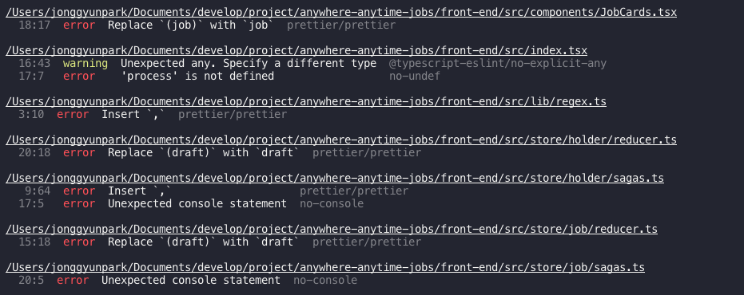

최근 회사에서도 본격적으로 eslint와 prettier를 적용하기로 결정하고 설정 및 Legacy 코드를 수정하는 작업을 진행하고 있다. prettier의 경우 개인프로젝트를 사용할 때, 항상 사용하고 있었지만 eslint는 다른 블로그를 보며 대충 적용하며 사용했었는데, 이번 기회에 제대로 설정하는 법을 정리하고자 이 글을 작성하게 되었다.

> 해당 설정은 제가 주로 사용하는 내용이므로, 일반적인 설정이 아닐수도 있습니다.

> 저는 주로 CRA를 이용한 React 프로젝트를 시작하기 때문에, 아래 내용은 CRA 기준입니다.

## 차례

1. ESLint, Prettier 설치 in vscode
2. ESLint 설치
3. ESLint config 설치
4. ESLint config 구성
5. .eslintignore
6. eslint --fix
7. prettier 설정하기
8. lint-staged & husky를 활용하기

### ESLint, Prettier Extension 설치

vscode를 사용할 경우 ESLint와 Prettier의 extenstion을 설치해야 vscode에서 lint, prettier 오류를 바로 확인할 수 있다.

### ESLint 설치

CRA를 이용하면 (CRA v2부터) ESLint가 자체적으로 설정되어있다. vscode에 extension을 설치한 상황이라면, 아무 파일에서 lint를 어기는 내용을 작성했을 때, 소스에 underline이 나타나는 것을 확인할 수 있다.

<!--  -->

### ESLint config 설치

ESLint에는 다른 사람들이 생성한 규칙을 이용하는 것도 가능하다. 예를 들면 가장 유명한 airbnb에서 만든 규칙인 eslint-config-airbnb를 설치하면 해당 규칙을 사용하는 것이 가능해진다. airbnb말고 다른 규칙을 사용하고 싶을 경우에는 eslint-config-xxx로 시작하는 다른 패키지를 설치하면 된다.

`eslint의 경우 개발 환경에서 확인하는 것이니 --dev 옵션을 넣어서 설치하는 것이 좋다`

```
  npm i ---dev eslint-config-airbnb
  or
  yarn add --dev eslint-config-airbnb
```

이제 설치한 config를 적용을 해야한다. CRA를 사용하면 package.json 파일에 eslint관련 설정이 가능한 객체가 있다.

```
"eslintConfig": {
  "extends": "react-app"
}
```

여기서 extends 부분을 ["react-app", "airbnb"] 로 수정하면 된다.

```
"eslintConfig": {
  "extends": ["react-app", "airbnb"]
}
```

위와 같이 수정할 경우, 프로젝트가 airbnb에서 설정한 규칙을 따라가게 된다.

Config 설정은 위와 같이 해도 되지만 별도의 `파일`로 관리할 수 있는데, eslint에서 지원하는 설정파일은 다음과 같다.

- .eslintrc.js
- .eslintrc.yaml 혹은 .eslintrc.yml
- .eslintrc.json
- .eslintrc - eslint 문서에서 `Deprecated`라고 설명된 것으로 봐서는 다른 파일로 설정해야할 것 같다.
- package.json 내부에 eslintConfig 객체

### ESLint config 구성

config의 내부는 다음과 같이 구성된다.

```
{
  "parserOption": {} // eslint에서 지원했으면 하는 Javascript option을 설정할 수 있다.
  "parser": "", // eslint에서 사용할 parser를 지정한다. default는 Espree. typescript를 사용할 경우 @typescript-eslint/parser로 설정하면 될듯.
  "env": {}, // 전역 변수를 정의
  "globals": {},
  "plugins": [""], // eslint-plugin-으로 시작하는 플러그인을 넣는다.
  "processor": "", // 플러그인에서 제공하는 프로세서를 작성하는 듯.. 잘 모르겠다.
  "rules": {}, // 여기서 rule에 대한 설정을 할 수 있다.
  "overrides": [{}, {}] // 특별한 파일에만 적용해야 하는 processor, rule를 설정할 수 있다.
}
```

예시)

```
{
  "parserOptions": {
    "ecmaVersion": 6,
    "ecmaFeatures": {
      "jsx": true
    }
  },
  "plugins": ["react", "prettier"],
  "extends": [
    "eslint:recommended",
    "plugin:react/recommended",
    "plugin:prettier/recommended"
  ],
  "env": {
    "es6": true,
    "browser": true
  },
  "rules": {
    "react/jsx-filename-extension": [
      1,
      { "extensions": [".js", ".jsx", ".ts", ".tsx"] }
    ],
    "react/prop-types": 0
  }
}
```

### ESLint에서 rule이 적용하는 방법

ESLint에서 rule이 적용되는 범위, rule를 설정하는 방법이 여러가지가 있다.

.eslintignore > .eslint config의 rules > .eslint config의 override > 각 파일에서 작성되는 comment

위 순서대로 적용된다.

### .eslintignore

ESLint가 적용되지 않는 대상을 정하는 파일이다.

```
src/serviceWorker.js  // 지정된 파일은 eslint에서 제외된다
src/**.test.js
```

### eslint 실행하기

package.json의 script에 eslint를 실행하는 명령어를 생성해서 그때그때 확인할 수 있다.

```
  "scripts": {
    "start": "react-scripts start",
    "build": "react-scripts build",
    "test": "react-scripts test",
    "eject": "react-scripts eject",
    "eslint": "eslint './src/**/*.{js,jsx}'"
  },
```

```
npm eslint
or
yarn eslint
```

<!-- 예시)

 -->

### prettier 설정하기

.prettierrc 파일을 생성 후 아래 내용을 입력하면 해당된 옵션이 작동한다.

prettier에 대한 옵션은 [여기](https://prettier.io/docs/en/options.html)에서 확인 가능하다.

vscode의 setting에서 format on save 옵션을 활성화하면 작업 중 저장을 하면 해당 옵션으로 코드가 자동정렬된다.

예시) 주로 사용하는 셋팅

```
{
  "singleQuote": true,
  "semi": true,
  "useTabs": false,
  "tabWidth": 2,
  "trailingComma": "all",
  "printWidth": 80
}

```

### lint-staged와 husky 활용하기

lint-staged와 husky를 활용하면 소스를 commit 하기 전에 lint, prettier에 어긋나는 소스가 commit되는 것을 방지할 수 있다.

```
npm i --dev lint-staged husky
or
yar add --dev lint-staged husky
```

- .lintstagedrc 파일은 root 위치에 생성 후 아래와 같이 작성한다.

```
{
  "*.js?(x)": "eslint"
}
```

- .huskyrc 파일은 root 위치에 생성 후 아래와 같이 작성한다.

```
{
  "hooks": {
  "pre-commit": "lint-staged"
  }
}
```

.lintstagedrc 파일과 .huskyrc 파일에 각각 위와 같이 저장해두면, commit전에 lint-staged를 실행하고, lint-staged에서 .js와 .jsx파일에 eslint를 실행하여 에러가 나는 부분을 보여주게 된다.

위의 두 명령어를 통과하지 못하면 commit이 되지 않게 된다. 이를 통해 코팅 컨벤션을 유지할 수 있게 된다.

이상 끝!!
